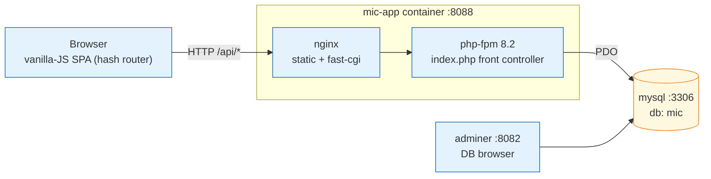

# Architecture — MIC

> Reference deliverable (Phase 01 solution): what a strong room converges on. Open only after you
> have produced your own.

## Components



Three containers (`docker-compose.yml`): **`mic-app`** (nginx + php-fpm 8.2 in one container,
port 8088), **`mysql`** 8.0 (port 3306, schema + seed mounted as init scripts), **`adminer`**
(port 8082, DB browser). No build step on the frontend; Chart.js from CDN.

## Request flow

```
Browser  →  nginx :8088  →  (static? serve from public/  :  index.php)
                              │
                              └─ /api/*  →  Router  →  Controller  →  Repository  →  PDO  →  MySQL
                                                                                          │
   { data } / { data, meta } / { error }  ◀───────────────────────────────────────────────┘
```

- `index.php` is the single front controller. It registers a CRUD route set per resource and
  dispatches via `src/Router.php` (a regex matcher, no framework).
- Every controller maps its `record_type` rows to a domain-shaped DTO and back. There is **no
  service/domain layer** between controller and SQL.
- Persistence is entirely through `src/Repository.php`, which only ever touches **two tables**:
  `business_data` and `business_relations`.

## Layers (such as they are)

| Layer | Where | Note |
|---|---|---|
| Presentation | `public/js/*` | SPA, one module per section |
| HTTP / routing | `index.php`, `src/Router.php` | front controller + regex router |
| "Application" | `src/Controllers/*` | business rules live here, inline |
| Persistence | `src/Repository.php`, `src/Models/*` | generic-table access |
| Storage | `business_data`, `business_relations` | one polymorphic schema for all 19 record types |

**The architectural tell:** the storage layer has no domain shape at all (see
[`coupling-map.md`](./coupling-map.md)), so the "application" layer carries every business rule with
nothing underneath to enforce it.
