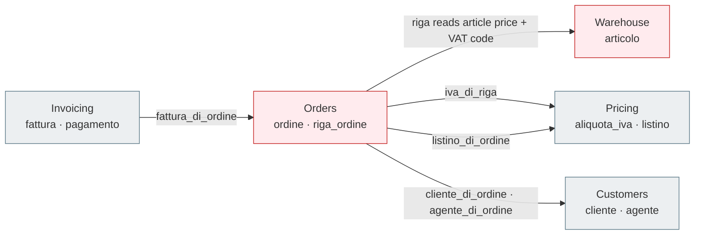

# Coupling map — MIC

> Reference deliverable (Phase 01 solution): the key finding of Phase 01. Open only after you have
> produced your own.

## How the data is actually stored

All business data lives in **two generic tables**. There is no `customers` table, no `articles`
table, no `orders` table.

- **`business_data`** — one row per business record, of any kind. The kind is the `record_type`
  column (**19 values**: `cliente`, `fornitore`, `contatto`, `articolo`, `categoria`,
  `aliquota_iva`, `listino`, `voce_listino`, `sconto`, `magazzino`, `movimento`, `agente`,
  `ordine`, `riga_ordine`, `fattura`, `nota_credito`, `pagamento`, `utente`, `audit_log`). Every
  field is positional and generic: `code`, `name`, `amount_1..4`, `text_1..5`, `date_1..3`,
  `status`, `payload_json`. The meaning of each column **depends on `record_type`**:

  | record_type | `code` | `amount_1` | `amount_2` | `amount_3` | `text_2` |
  |---|---|---|---|---|---|
  | `articolo` | SKU | base price | min qty | — | **VAT code** |
  | `ordine` | order no. | taxable total | VAT total | grand total | — |
  | `fattura` | invoice no. | taxable | VAT | total | — |
  | `cliente` | VAT id | — | — | — | PEC |

- **`business_relations`** — one row per N-N / soft 1-N link, typed by `relation_type` with an
  optional `amount`. This is where cross-record links live (an order's customer, a line's article,
  a line's VAT rate, ...).

## The cross-domain couplings

Run in Adminer to see every coupling at a glance:

```sql
SELECT src.record_type AS source, br.relation_type AS relation,
       tgt.record_type AS target, COUNT(*) AS occurrences
FROM business_relations br
JOIN business_data src ON src.id = br.source_id
JOIN business_data tgt ON tgt.id = br.target_id
GROUP BY src.record_type, br.relation_type, tgt.record_type
ORDER BY occurrences DESC;
```



### The load-bearing one: Orders → Warehouse

When a line is added to an order, **Orders reaches directly into the article record** to get its
price and VAT. Evidence — `OrderController::addRiga()` in
`php-app/src/Controllers/OrderController.php`:

```php
$articolo = $this->repo->findById($art_id);          // load the Warehouse-owned record
if ($prezzo <= 0) $prezzo = (float)($articolo->amount1 ?? 0);   // price = articolo.amount_1
$iva_code = $articolo->text2 ?? 'IVA22';             // VAT code = articolo.text_2
$ivaRow = $this->repo->rawOne(
    'SELECT id, amount_1 FROM business_data WHERE record_type=? AND code=? LIMIT 1',
    ['aliquota_iva', $iva_code]);                     // → Pricing lookup
```

Orders depends on the **internal column layout** of an article (`amount_1` is the price, `text_2`
is the VAT code) and on the `aliquota_iva` records. Nothing mediates this: there is no contract, no
ownership boundary. If Warehouse ever changes how an article stores its price, Orders breaks
silently.

## What an extraction must break

To carve **Warehouse** out first, that direct read has to be replaced by a **contract** (an API /
anti-corruption layer): Orders asks the Warehouse service "what is the price and VAT of this
article?" instead of reading `articolo.amount_1` / `text_2` itself. This is exactly what Phase 02
formalizes (dependency map, context mapping) and the later phases implement.

> **Exit-question answers.** (1) The dependency to deal with first is *Orders → Warehouse* (order
> lines read article price + VAT directly). (2) The single design choice that makes MIC hardest to
> change safely is the **one polymorphic schema** — it removes every boundary the database could
> have enforced. (3) A new feature hurts most wherever it needs a new field: there is nowhere
> type-safe to put it, so it lands in another generic column or in `payload_json`.
