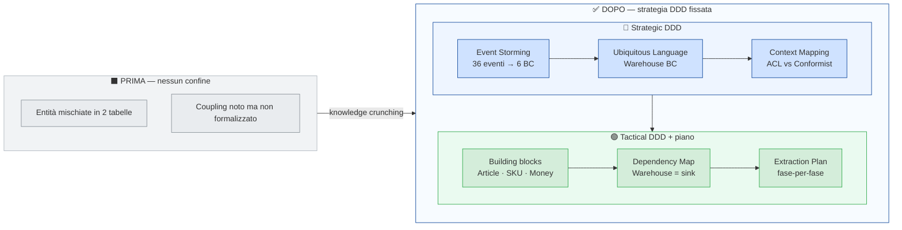

# Phase 02 — Analisi & Design (DDD Strategico + Tattico)

> English version: [`README.md`](./README.md)

```text
 ___  ___  ___    ___      ___  _      _    _  _
|   \|   \|   \  ( _ )_   | _ \| |    /_\  | \| |
| |) | |) | |) | / _ \ \  |  _/| |__ / _ \ | .` |
|___/|___/|___/  \___/\_\ |_|  |___|/_/ \_\|_|\_|

  Phase 02 — Dall'analisi DDD a un piano Strangler Fig.
```

Tempo stimato: ~1h 30min — lettura 45min · participant checklist 35min · ADR-001 + ADR-010 + ADR-011 10min.

```text
Phase 01    monolite MIC (baseline)
     |
Phase 02    Analisi & Design  <-- sei qui
     |
Phase 03+   servizio Go
```

> Checkpoint di pura analisi e design: **niente codice, niente Docker**. L'output
> è un insieme di artefatti markdown che fissano le decisioni strategiche e
> tattiche che tutte le successive Go-phase erediteranno.

---

## Cosa acquisisci in questa fase

> Checkpoint solo-documentazione: niente codice. Trasformi un dominio aggrovigliato nelle decisioni strategiche + tattiche che ogni fase Go eredita.



## Obiettivi di apprendimento

Alla fine di Phase 02 dovresti essere in grado di:

1. **Condurre un Event Storming** su una narrazione di dominio usando il metodo in tre passi (enumerate → cluster → name) e spiegare _perché_ i passi devono essere in quell'ordine
2. **Definire la Ubiquitous Language** di un Bounded Context con una tabella del vocabolario e spiegare _perché_ la UL è ubiquita solo dentro il BC
3. **Validare il codice contro la UL** usando i prompt AI in [`ubiquitous-language.md`](./ubiquitous-language.md) per scoprire deriva lessicale (sinonimi in uso, termini mancanti, nomi inventati)
4. **Identificare i Bounded Context candidati** da un canvas di Event Storming e nominare la responsabilità di ciascuno
5. **Scegliere il pattern di Context Mapping corretto** fra due BC dato il bilanciamento di potere
6. **Mappare le decisioni strategiche sui building block DDD tattici** (Aggregate, Entity, Value Object, Domain Event) per un BC
7. **Leggere la dependency map** di un modulo legacy e giustificare se è _safe-to-extract first_ in una migrazione Strangler Fig
8. **Pianificare un'estrazione Strangler Fig** come sequenza di phase indipendentemente deployabili

Se rispondi **8/8**, sei pronto per Phase 03 (Go skeleton + prima implementazione tattica).

---

## Letture di background

> 🧭 **Se termini come _Bounded Context_, _Ubiquitous Language_, _Aggregate root_, _Context Mapping_ ti sono nuovi, leggi prima queste.** Il README assume che tu sappia scegliere un pattern per nome.

| #   | Documento                                                                                             | Cosa ti dà                                                                                                  | Tempo  |
| --- | ----------------------------------------------------------------------------------------------------- | ----------------------------------------------------------------------------------------------------------- | ------ |
| 1   | [`docs/adr/ADR-001-strangler-fig-pattern.md`](../docs/adr/ADR-001-strangler-fig-pattern.md)           | Il _perché_ dietro l'esercizio in 10 phase — estrazione incrementale e sicura invece di un big-bang rewrite | ~5 min |
| 2   | [`docs/adr/ADR-010-event-storming-methodology.md`](../docs/adr/ADR-010-event-storming-methodology.md) | Il metodo Event Storming in tre passi e i failure mode che previene                                         | ~5 min |
| 3   | [`docs/adr/ADR-011-ddd-building-blocks.md`](../docs/adr/ADR-011-ddd-building-blocks.md)               | I quattro building block DDD tattici usati per nome in tutto il servizio Go                                 | ~5 min |

**Riferimento del corso:** Tech Track 2 **Modulo 2.3** — _Refactoring from Legacy to Capability-Driven_.

**Riferimenti esterni canonici** (opzionali, per approfondire):

- Eric Evans, _Domain-Driven Design: Tackling Complexity in the Heart of Software_ (2003)
- Vaughn Vernon, _Implementing Domain-Driven Design_ (2013)
- Vlad Khononov, _Learning Domain-Driven Design_ (2021)
- Alberto Brandolini, _Introducing EventStorming_ (2018, Leanpub)
- Free DDD Reference (Evans, 2015)

---

## Novità

Phase 02 è un checkpoint **solo-documenti** — niente Docker, niente Go, niente MySQL. Cinque artefatti markdown che fissano le decisioni di analisi e design dell'estrazione del Warehouse:

| Cosa hai                | Dove                                                       | Cos'è                                                                                                                        |
| ----------------------- | ---------------------------------------------------------- | ---------------------------------------------------------------------------------------------------------------------------- |
| Canvas Event Storming   | [`event-storming-canvas.md`](./event-storming-canvas.md)   | Canvas in tre passi: 36 eventi past-tense → 6 cluster → 6 BC candidati; bonus aggregate decomposition                        |
| **Ubiquitous Language** | [`ubiquitous-language.md`](./ubiquitous-language.md)       | Vocabolario canonico del BC Warehouse + pattern per team multilingua + prompt AI per la validazione del codice               |
| Context Mapping         | [`context-mapping.md`](./context-mapping.md)               | Pattern _fra_ BC: Customer/Supplier, Conformist, ACL, OHS, Shared Kernel, Partnership, Separate Ways, Published Language     |
| Tactical DDD            | [`tactical-ddd-warehouse.md`](./tactical-ddd-warehouse.md) | Building block DDD _dentro_ Warehouse: Aggregate (Article), Entity (InventoryLevel), Value Object (SKU, Money), Domain Event |
| Dependency Map          | [`DEPENDENCY-MAP.md`](./DEPENDENCY-MAP.md)                 | Coupling concreto in-bound / out-bound di Warehouse nel monolite MIC (con riferimenti riga-per-riga al codice PHP)           |

---

## Layout logico della phase — Part 1 (Strategico) + Part 2 (Tattico)

Phase 02 è una singola phase, ma copre due metà distinte del DDD. Leggerle in questo ordine rispecchia come le decisioni sono state effettivamente prese.

### Part 1 — DDD Strategico (analizzare il dominio)

La metà _importante_. Spesso saltata — ed è il motivo per cui i team producono codice "DDD-flavoured" che è decorazione sopra del CRUD.

1. **Event Storming** — far emergere gli eventi che il business effettivamente emette. Scoprire i BC candidati dai cluster. [`event-storming-canvas.md`](./event-storming-canvas.md)
2. **Ubiquitous Language** — fissare un termine canonico per ogni concetto dentro ciascun BC. Vietare i sinonimi. Collegare la UL al codice fin dal day-one. [`ubiquitous-language.md`](./ubiquitous-language.md)
3. **Context Mapping** — nominare il pattern di relazione fra ogni coppia di BC che si scambia dati. Le decisioni di integrazione discendono dal pattern. [`context-mapping.md`](./context-mapping.md)

### Part 2 — DDD Tattico + piano di estrazione (tradurre la strategia in codice e roadmap di migrazione)

La metà che diventa codice Go (Phase 03+) **e** roadmap Strangler Fig. Solo lo step 4 è DDD tattico vero e proprio; lo step 5 verifica la storia strategica sul codice reale e la traducono in un piano di migrazione phase-per-phase.

4. **Building block** per il BC Warehouse — Aggregate / Entity / Value Object / Domain Event. Mappare ogni termine business della UL su un blocco. [`tactical-ddd-warehouse.md`](./tactical-ddd-warehouse.md)
5. **Dependency map** — verificare la storia strategica sul codice PHP reale. Il numero di edge in-bound/out-bound decide la safety dell'estrazione. [`DEPENDENCY-MAP.md`](./DEPENDENCY-MAP.md)

> 💡 **Il DDD è più che Aggregate / VO / Repository.** Un errore comune riduce il DDD ai soli pattern _tattici_. In realtà il DDD ha due metà. Parte modellando lo **spazio del problema** tramite knowledge crunching — usando tecniche come Event Storming o Domain Storytelling, più l'individuazione dei sotto-domini — per capire cosa fa davvero il business. Poi passa allo **spazio della soluzione**: design dei Bounded Context, definizione della Ubiquitous Language dentro ciascun BC, context mapping fra di essi, e solo alla fine i pattern tattici (Aggregate, Entity, Value Object, Domain Event, Repository) che traducono il lavoro strategico in codice. Entrambe le metà sono DDD: applica i pattern tattici senza il lavoro strategico e ottieni CRUD "DDD-flavoured"; fai prima il lavoro strategico e i pattern tattici acquistano la loro leva. Il Modulo 2.3 apre con il DDD strategico apposta.

---

## Come navigare questa phase

> ⚠ **Leggi gli artefatti nell'ordine giusto.** Ogni documento presuppone il precedente. Saltare direttamente a `tactical-ddd-warehouse.md` senza `ubiquitous-language.md` ti lascerà a chiederti perché la tabella usa certe parole. Segui l'ordine in [Part 1 + Part 2 sopra](#layout-logico-della-phase--part-1-strategico--part-2-tattico) — la sezione [Esercizi](#esercizi) sotto ti guida passo per passo.

> 🤖 **Non saltare i prompt AI della UL.** [`ubiquitous-language.md`](./ubiquitous-language.md) include tre prompt AI per il lifecycle della UL (produrre, auditare, generare codice). **Esegui almeno il Prompt 1** durante questa phase: passagli [`event-storming-canvas.md`](./event-storming-canvas.md) come input e confronta la UL prodotta dall'AI col vocabolario che stai leggendo. Il confronto cementa il legame Event Storming → UL.

---

## Esercizi

Questo è il walk-through concreto. Eseguili in ordine; ogni step si costruisce sul precedente.

### Step 1 — Leggi il canvas dell'Event Storming (10 min)

> 💡 **Event Storming** — tecnica di workshop di Alberto Brandolini (2013). Un gruppo eterogeneo brainstorma un processo di business scrivendo eventi past-tense su un muro. L'output è una timeline di fatti + un clustering di quei fatti in Bounded Context candidati. Low-tech, alta resa.

Apri [`event-storming-canvas.md`](./event-storming-canvas.md) e rispondi:

- **D1.** Perché lo Step 1 (_enumerate_) vieta il filtering? Cosa succede se inizi a clusterizzare durante l'enumerazione?

> 🤖 **Prompt AI per Step 1**
>
> - **Spiega più a fondo:** _"Spiega perché l'Event Storming di Brandolini parte da eventi past-tense invece che da nomi o processi. Riferisciti al Modulo 2.3 (Refactoring from Legacy to Capability-Driven). Perché la scelta 'verbi vs nomi' non è cosmetica?"_
> - **Stress-test:** _"Un collega afferma: 'L'Event Storming è solo un modo elegante per disegnare diagrammi UML use case — l'unica differenza sono i post-it invece dei tool digitali.' Trova ogni errore in questa affermazione usando `event-storming-canvas.md`."_

### Step 2 — Leggi la Ubiquitous Language (15 min)

> 💡 **Ubiquitous Language (UL)** — il linguaggio unico condiviso fra esperti di dominio e sviluppatori dentro un BC. Ogni termine ha esattamente un significato. **La UL deve essere usata nel codice** — altrimenti è decorazione.

> 🎯 **Perché la UL paga dividendi ogni giorno dopo Phase 02:** parli con gli esperti di dominio nelle loro parole (niente step di traduzione); una nuova feature request atterra al posto giusto nel codice (i suoi verbi/nomi si mappano su termini UL esistenti); review e demo si accorciano (codice e business parlano la stessa lingua); un nuovo arrivato naviga il codebase più facilmente. La ragione storica per cui la disciplina UL fallisce — _"scritta nello Sprint 0, poi dimenticata"_ — è il gap che **oggi l'AI chiude**: i tre prompt in `ubiquitous-language.md` rendono il drift UL rilevabile dopo ogni PR, non una volta l'anno.

Apri [`ubiquitous-language.md`](./ubiquitous-language.md) e rispondi:

- **D2.** Perché "Article" nella UL del Warehouse è un concetto diverso da "Article" in Catalog, anche se la tabella legacy `business_data` non li distingue?
- **D3.** Quali pericoli espone il definire dei sinonimi per un termine della UL?

> 🤖 **Prompt AI per Step 2**
>
> - **Applica al canvas:** \_"Usa il **Prompt 1** in `ubiquitous-language.md`. Confronta la UL prodotta dall'AI col vocabolario in `ubiquitous-language.md`.
> - **Stress-test:** _"Un collega dice: 'La Ubiquitous Language è solo un glossario per gli esperti di dominio — gli sviluppatori non ne hanno bisogno perché hanno il codice come documentazione.' Argomenta contro questa posizione usando esempi concreti da `ubiquitous-language.md`."_

### Step 3 — Leggi il Context Mapping (10 min)

> 💡 **I pattern di Context Mapping** appartengono a tre famiglie: **Cooperation** (Partnership, Shared Kernel), **Upstream/Downstream** (Customer/Supplier, Conformist, ACL, OHS, Published Language), e **Separate Ways**. Il pattern che scegli _vincola_ ogni decisione cross-BC successiva.

Apri [`context-mapping.md`](./context-mapping.md) e rispondi:

- **D4.** Qual è la differenza precisa fra **Customer/Supplier** e **Conformist**, dato che entrambi sono pattern Upstream/Downstream?
- **D5.** Perché il Go Warehouse BC usa un **Anti-Corruption Layer** con lo schema legacy MIC invece di una relazione Conformist? Identifica il trade-off costo-beneficio.

> 🤖 **Prompt AI per Step 3**
>
> - **Spiega più a fondo:** _"Confronta Customer/Supplier e Conformist. Sono entrambi pattern Upstream/Downstream; la differenza è il bilanciamento di potere. Usa `context-mapping.md` per spiegare: quando Customer/Supplier scivola in Conformist? Fornisci un esempio concreto."_
> - **Stress-test:** *"Un collega propone: 'Usiamo **Shared Kernel** fra Warehouse e Catalog — entrambi hanno un concetto di Article e possono condividere un modulo Go.' Argomenta contro, citando le definizioni UL di Article in ciascun BC e la descrizione della famiglia *Cooperation* in `context-mapping.md`."*

### Step 4 — Leggi i building block del DDD tattico (10 min)

> 💡 **I building block DDD tattici** — Aggregate (con una root), Entity (identità, mutable), Value Object (no identità, sostituibile, factory fail-loud), Domain Event (past-tense, immutable). Il Warehouse BC usa questi quattro nomi in tutto il servizio Go.

Apri [`tactical-ddd-warehouse.md`](./tactical-ddd-warehouse.md) e rispondi:

- **D6.** Perché `InventoryLevel` ha un'identità (`ID`) mentre `SKU` no? Rispondi usando le definizioni di Entity e Value Object.

> 🤖 **Prompt AI per Step 4**
>
> - **Applica al codice:** _"Apri `phase-01-monolith/php-app/src/Controllers/ArticleController.php`. Il controller legacy rispetta le invarianti dell'Aggregate definite in `tactical-ddd-warehouse.md`? Per ogni invariante indica: rispettata, violata, o completamente assente. Cosa dice ogni violazione sul costo di tenere la logica di dominio nel monolite?"_
> - **Stress-test:** _"Un PR propone di creare `interfaces.InventoryRepository` con metodi `Save / FindByID / Delete` perché 'caricare l'intero aggregate Article è sprecato per certe query'. Argomenta contro, citando ADR-011 e `tactical-ddd-warehouse.md`. Identifica tre conseguenze negative."_

### Step 5 — Leggi la Dependency Map (10 min)

Apri [`DEPENDENCY-MAP.md`](./DEPENDENCY-MAP.md) e rispondi:

- **D7.** Perché Warehouse è chiamato _"un sink"_ in `DEPENDENCY-MAP.md`, e cosa implica per l'ordine di estrazione? Cita i conteggi in-bound / out-bound.

> 🤖 **Prompt AI per Step 5**
>
> - **Applica al codice:** _"Apri `phase-01-monolith/php-app/src/Controllers/OrderController.php` e individua `addRiga()`. Cammina le righe 121–176 e mappa ogni chiamata verso Warehouse (lookup articolo, creazione relazione) sulla riga corrispondente di `DEPENDENCY-MAP.md`. Dove la documentazione descrive una chiamata che non esiste nel codice (o viceversa)?"_
> - **Stress-test:** _"`DEPENDENCY-MAP.md` conclude che Warehouse è 'safe-to-extract first'. Un collega lo legge come 'possiamo sostituire il servizio PHP con quello Go in un singolo deploy, senza periodo di transizione.' Quale singolo numero nel documento mostra perché un periodo di transizione è obbligatorio?"_

### Step 7 — Stretch opzionale (30–45 min)

- Esegui il **Prompt AI 2** in `ubiquitous-language.md` contro `phase-01-monolith/php-app/src/`. Leggi la Tabella A (UL → code) e riporta quali termini UL _non_ si trovano nel codice PHP; analizza il perché (D: effettivamente mancanti, o nominati diversamente per convenzioni legacy?).
- Disegna un canvas di Event Storming per uno dei tuoi progetti interni. Fotografa il risultato e portalo alla review della prossima phase.

---

## Architecture (layout della directory)

```text
phase-02-analysis/
├── README.md                       ← versione EN canonica
├── README-IT.md                    ← questo file (IT parallelo)
│
├── event-storming-canvas.md        ← Part 1 — DDD strategico: scoprire eventi e BC
├── ubiquitous-language.md          ← Part 1 — DDD strategico: definire il vocabolario
├── context-mapping.md              ← Part 1 — DDD strategico: scegliere pattern di integrazione
│
├── tactical-ddd-warehouse.md       ← Part 2 — DDD tattico: aggregate / entity / VO / event
├── DEPENDENCY-MAP.md               ← Part 2 — Coupling reale nel codice PHP
│
├── solutions/
│   ├── README.md                   ← worked answers (EN)
│   └── README-IT.md                ← worked answers (IT)
│
```

---

## Verifica

Spunta tutti questi prima di passare a Phase 03:

- [ ] Sai condurre un Event Storming su una narrazione di dominio di 1 pagina senza guardare i passi
- [ ] Sai scrivere una riga di UL per un nuovo termine di dominio (canonico EN, traduzione italiana, definizione)
- [ ] Hai eseguito almeno il **Prompt AI 1** in `ubiquitous-language.md` con `event-storming-canvas.md` come input e confrontato la UL prodotta dall'AI col vocabolario dell'artefatto
- [ ] Sai nominare la famiglia (Cooperation / Upstream-Downstream / Separate Ways) per ogni integrazione cross-BC del sistema
- [ ] Sai classificare un nuovo nome legato a Warehouse come Aggregate / Entity / Value Object / Domain Event / fuori-BC
- [ ] Hai risposto a tutte le 7 domande della participant checklist
- [ ] Hai letto ADR-001, ADR-010 e ADR-011

---

## Known scope gaps (intentional)

| Gap                                                                                                                                                        | Dove                                                       | Risolto da                                                |
| ---------------------------------------------------------------------------------------------------------------------------------------------------------- | ---------------------------------------------------------- | --------------------------------------------------------- |
| **`StockReservation`** è un termine completo nella UL ma nei primi fasi Go è semplificato a un contatore `Reserved` dentro `InventoryLevel`                | [`tactical-ddd-warehouse.md`](./tactical-ddd-warehouse.md) | Phase 05+ lo promuove a entity completa                   |
| **`StockMovement`** ledger è completamente fuori scope dal Go BC                                                                                          | [`tactical-ddd-warehouse.md`](./tactical-ddd-warehouse.md) | Non pianificato; resta nel monolite PHP                   |
| **`WarehouseLocation`** è descritto come VO con regex `^[A-Z]{2}-[A-Z0-9]{3,8}$` ma oggi è memorizzato come campo `LocationCode string`                    | [`tactical-ddd-warehouse.md`](./tactical-ddd-warehouse.md) | Una phase successiva può promuoverlo a tipo VO Go         |
| **Partnership, Shared Kernel, OHS, Published Language, Separate Ways** sono documentati in `context-mapping.md` ma non occorrono nell'estrazione Warehouse | [`context-mapping.md`](./context-mapping.md)               | Listati per maintainer futuri; non richiesti per Phase 03 |

Queste sono **semplificazioni deliberate**. Il partecipante deve essere in grado di individuarle e spiegare _perché_ la semplificazione è accettabile per il budget di 20 ore.

---

## AI-Assisted workflow

Phase 02 è una phase **di lettura e design**. L'AI aiuta in tre modi distinti; non è una phase di code-generation.

| Flavour                | Quando usarlo                                               | Cosa aspettarti                                                                                                                          |
| ---------------------- | ----------------------------------------------------------- | ---------------------------------------------------------------------------------------------------------------------------------------- |
| **Spiega più a fondo** | Dopo aver letto un artefatto, prima di consultare la sezione finale delle soluzioni  | Una spiegazione chiara che va oltre il documento — dovrebbe citare ADR-001/010/011 e slide quando rilevante                              |
| **Applica al codice**  | Dopo lo Step 2 e lo Step 4 (UL → codice; tactical → codice) | L'AI esegue un audit strutturato (tabella) e fa emergere la deriva. **I tre Prompt AI in `ubiquitous-language.md` sono il set canonico** |
| **Stress-test**        | Dopo che hai la tua risposta                                | L'AI deve trovare gli errori e spiegare _perché_. Se non li trova, sai qualcosa che l'AI non sa — è una vittoria reale                   |

### Tre regole d'oro

1. **Prova sempre la domanda da solo prima.** L'AI è uno strumento di comprensione più profonda qui, non una scorciatoia per la risposta.
2. **Confronta la risposta dell'AI con la sezione finale Soluzioni.** Se discordano su un fatto, il file delle solutions è la fonte di verità (è revisionato contro gli artefatti). Se discordano sull'enfasi, possono avere ragione entrambi.
3. **Spingi indietro quando l'AI allucina.** _"Dove in `ubiquitous-language.md` hai visto questo?"_ — l'AI o si corregge o espone un gap.

> 💡 **Il vero deliverable di Phase 02 è uno _strumento che costruisci tu_ — non le risposte alle 7 domande.** I tre prompt AI in `ubiquitous-language.md` sono uno scaffold: tara la formulazione, cambia il formato di output, aggiungi colonne (severity, owner, suggested fix) o sperimenta formati di UL diversi. Phase 02 si chiude con successo quando hai un workflow di validazione UL di cui ti fidi abbastanza da eseguirlo dopo ogni PR.

---

## Fase successiva

→ **Phase 03 — Go Skeleton (DDD Foundation)** traduce le decisioni strategiche + tattiche di questa phase in codice Go.

---

## References

- **ADR-001** — Strangler Fig pattern (il razionale per l'esercizio in 10 phase)
- **ADR-010** — Event Storming methodology (il _perché_ di `event-storming-canvas.md`)
- **ADR-011** — DDD building blocks (il _perché_ di `tactical-ddd-warehouse.md`)
- **[`ubiquitous-language.md`](./ubiquitous-language.md)** — vocabolario canonico + prompt AI per validazione del codice
- **[`tactical-ddd-warehouse.md`](./tactical-ddd-warehouse.md)** — mapping Aggregate / Entity / VO / Domain Event per Warehouse
- **[`context-mapping.md`](./context-mapping.md)** — pattern Cooperation / Upstream-Downstream / Separate Ways
- **[`event-storming-canvas.md`](./event-storming-canvas.md)** — output dell'Event Storming Warehouse (36 eventi → 6 BC)
- **[`DEPENDENCY-MAP.md`](./DEPENDENCY-MAP.md)** — coupling in-bound / out-bound di Warehouse nel monolite MIC
- [`phase-01-monolith/`](../phase-01-monolith/) — il baseline PHP il cui accoppiamento questa analisi documenta

## Soluzioni

Le soluzioni sono disponibili in [`solutions/README-IT.md`](./solutions/README-IT.md).

Usale solo dopo aver completato gli esercizi e aver eseguito i test richiesti.
