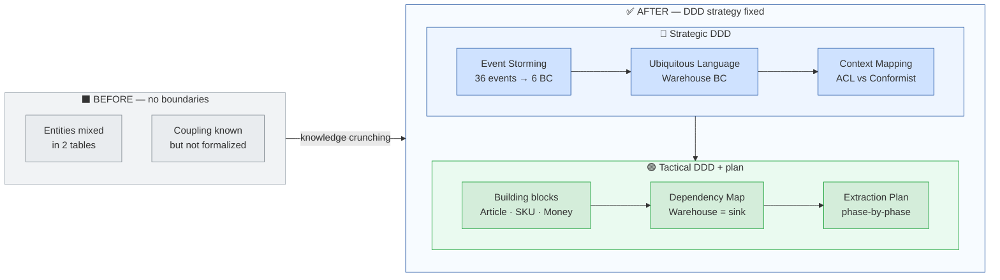

# Phase 02 — Analysis & Design (Strategic + Tactical DDD)

> Italian version: [`README-IT.md`](./README-IT.md)

```text
 ___  ___  ___    ___      ___  _      _    _  _
|   \|   \|   \  ( _ )_   | _ \| |    /_\  | \| |
| |) | |) | |) | / _ \ \  |  _/| |__ / _ \ | .` |
|___/|___/|___/  \___/\_\ |_|  |___|/_/ \_\|_|\_|

  Phase 02 — From DDD discovery to a Strangler Fig plan.
```

Estimated time: ~1h 30min — reading 45min · participant checklist 35min · ADR-001 + ADR-010 + ADR-011 10min.

```text
Phase 01    MIC monolith (baseline)
     |
Phase 02    Analysis & Design  <-- you are here
     |
Phase 03+   Go service
```

> Pure analysis-and-design checkpoint: **no code, no Docker**. The output is a set of
> markdown artefacts that fix the strategic and tactical decisions every subsequent
> Go phase will inherit.

---

## What You Gain in This Phase

> Docs-only checkpoint: no code. You turn a tangled domain into the strategic + tactical decisions every Go phase inherits.



## Learning Objectives

By the end of Phase 02 you should be able to:

1. **Run an Event Storming** on a domain narrative using the three-step method (enumerate → cluster → name) and explain _why_ the steps must be done in that order
2. **Define the Ubiquitous Language** of one Bounded Context with a vocabulary table and explain _why_ the UL is ubiquitous only inside the BC
3. **Validate code against the UL** using the AI prompts in [`ubiquitous-language.md`](./ubiquitous-language.md) and surface lexical drift (synonyms used, missing terms, names invented)
4. **Identify Bounded Context candidates** from an Event Storming canvas and name the responsibility of each
5. **Pick the right Context Mapping pattern** between two BCs given the power balance
6. **Map the strategic decisions onto tactical DDD building blocks** (Aggregate, Entity, Value Object, Domain Event) for one BC
7. **Read the dependency map** of a legacy module and justify whether it is _safe to extract first_ in a Strangler Fig migration
8. **Plan a Strangler Fig extraction** as a sequence of phases that are each independently deployable

If you can do **8/8**, you are ready for Phase 03 (Go skeleton + first tactical implementation).

---

## Background reading

> 🧭 **If terms like _Bounded Context_, _Ubiquitous Language_, _Aggregate root_, _Context Mapping_ are new to you, read these first.** The README assumes you can pick a pattern by name.

| #   | Document                                                                                              | What it gives you                                                                             | Time   |
| --- | ----------------------------------------------------------------------------------------------------- | --------------------------------------------------------------------------------------------- | ------ |
| 1   | [`docs/adr/ADR-001-strangler-fig-pattern.md`](../docs/adr/ADR-001-strangler-fig-pattern.md)           | The _why_ behind the extraction exercise — incremental, safe extraction over a big-bang rewrite | ~5 min |
| 2   | [`docs/adr/ADR-010-event-storming-methodology.md`](../docs/adr/ADR-010-event-storming-methodology.md) | The three-step Event Storming method and the failure modes it prevents                        | ~5 min |
| 3   | [`docs/adr/ADR-011-ddd-building-blocks.md`](../docs/adr/ADR-011-ddd-building-blocks.md)               | The four DDD tactical building blocks used by name throughout the Go service                  | ~5 min |

**Course reference:** Tech Track 2 **Module 2.3** — _Refactoring from Legacy to Capability-Driven_.

**External canonical references** (optional, deeper dive):

- Eric Evans, _Domain-Driven Design: Tackling Complexity in the Heart of Software_ (2003)
- Vaughn Vernon, _Implementing Domain-Driven Design_ (2013)
- Vlad Khononov, _Learning Domain-Driven Design_ (2021)
- Alberto Brandolini, _Introducing EventStorming_ (2018, Leanpub)
- Free DDD Reference (Evans, 2015)

---

## What's New

Phase 02 is a **docs-only** checkpoint — there is no Docker, no Go, no MySQL. Five markdown artefacts that encompass the analysis and design decisions of the Warehouse extraction:

| You get                 | Where                                                      | What it is                                                                                                                     |
| ----------------------- | ---------------------------------------------------------- | ------------------------------------------------------------------------------------------------------------------------------ |
| Event Storming canvas   | [`event-storming-canvas.md`](./event-storming-canvas.md)   | Three-step canvas: 36 past-tense events → 6 clusters → 6 BC candidates; bonus aggregate decomposition                          |
| **Ubiquitous Language** | [`ubiquitous-language.md`](./ubiquitous-language.md)       | Canonical vocabulary of the Warehouse BC + multi-language team patterns + AI prompts for code validation                       |
| Context Mapping         | [`context-mapping.md`](./context-mapping.md)               | Patterns _between_ BCs: Customer/Supplier, Conformist, ACL, OHS, Shared Kernel, Partnership, Separate Ways, Published Language |
| Tactical DDD            | [`tactical-ddd-warehouse.md`](./tactical-ddd-warehouse.md) | DDD building blocks _inside_ Warehouse: Aggregate (Article), Entity (InventoryLevel), Value Object (SKU, Money), Domain Event  |
| Dependency Map          | [`DEPENDENCY-MAP.md`](./DEPENDENCY-MAP.md)                 | Concrete in-bound / out-bound coupling of Warehouse in the MIC monolith (with line-level references to PHP code)               |

---

## Phase logical layout — Part 1 (Strategic) + Part 2 (Tactical)

Phase 02 is one phase, but it covers two distinct halves of DDD. Reading it in this order matches how the decisions were actually made.

### Part 1 — Strategic DDD (analyse the domain)

The _important_ half. Often skipped — and that is why teams produce "DDD-flavoured" code that is decoration on top of CRUD.

1. **Event Storming** — surface the events the business actually emits. Discover BC candidates from clusters. [`event-storming-canvas.md`](./event-storming-canvas.md)
2. **Ubiquitous Language** — pin down one canonical term per concept inside each BC. Forbid synonyms. Connect the UL to the code from day one. [`ubiquitous-language.md`](./ubiquitous-language.md)
3. **Context Mapping** — name the relationship pattern between every pair of BCs that exchange data. Drive integration decisions from the pattern. [`context-mapping.md`](./context-mapping.md)

### Part 2 — Tactical DDD + extraction plan (turn strategy into code and a migration roadmap)

The half that turns into Go code (Phase 03+) **and** into the Strangler Fig roadmap. Only step 4 is tactical DDD proper; step 5 verifies the strategic story on the real codebase.

4. **Building blocks** for the Warehouse BC — Aggregate / Entity / Value Object / Domain Event. Map each business term in the UL to one block. [`tactical-ddd-warehouse.md`](./tactical-ddd-warehouse.md)
5. **Dependency map** — verify the strategic story on the real PHP code. The number of in-bound/out-bound edges decides extraction safety. [`DEPENDENCY-MAP.md`](./DEPENDENCY-MAP.md)

> 💡 **DDD is more than Aggregate / VO / Repository.** A common misconception reduces DDD to its _tactical_ patterns. In fact, DDD has two halves. It starts by modelling the **problem space** through knowledge crunching — using techniques like Event Storming or Domain Storytelling, plus sub-domain discovery — to understand what the business actually does. It then moves to the **solution space**: designing Bounded Contexts, defining the Ubiquitous Language inside each BC, context mapping between them, and only at the end the tactical patterns (Aggregate, Entity, Value Object, Domain Event, Repository) that turn the strategic work into code. Both halves are DDD: apply the tactical patterns without the strategic work and you get "DDD-flavoured" CRUD; do the strategic work first and the tactical patterns earn their leverage. Module 2.3 leads with strategic DDD on purpose.

---

## How to navigate this phase

> ⚠ **Read the artefacts in the right order.** Each document presupposes the previous one. Jumping straight into `tactical-ddd-warehouse.md` without `ubiquitous-language.md` will leave you wondering why the table uses certain words. Follow the order in [Part 1 + Part 2 above](#phase-logical-layout--part-1-strategic--part-2-tactical) — the [Exercises](#exercises) section below walks you through it.

> 🤖 **Don't skip the UL AI prompts.** [`ubiquitous-language.md`](./ubiquitous-language.md) ships three AI prompts for the UL lifecycle (produce, audit, generate code). **Run at least Prompt 1** during this phase: feed it [`event-storming-canvas.md`](./event-storming-canvas.md) as input and compare the AI-produced UL with the vocabulary you're reading. The comparison cements the Event Storming → UL link.

---

## Exercises

This is the concrete walk-through. Do these in order; each step builds on the previous one.

### Step 1 — Read the Event Storming canvas (10 min)

> 💡 **Event Storming** — Alberto Brandolini's workshop technique (2013). A heterogeneous group brainstorms a business process by writing past-tense events on a wall. The output is a timeline of facts + a clustering of those facts into candidate Bounded Contexts. Low-tech, high-yield.

Open [`event-storming-canvas.md`](./event-storming-canvas.md) and answer:

- **Q1.** Why does Step 1 (_enumerate_) forbid filtering? What goes wrong if you start clustering during enumeration?

> 🤖 **AI prompts for Step 1**
>
> - **Explain deeper:** _"Explain why Brandolini's Event Storming starts with past-tense events instead of nouns or processes. Reference Module 2.3 (Refactoring from Legacy to Capability-Driven). Why is the 'verbs vs nouns' choice not cosmetic?"_
> - **Stress-test:** _"A colleague claims: 'Event Storming is just a fancy way to draw UML use case diagrams — the only difference is sticky notes instead of digital tooling.' Find every error in this claim using `event-storming-canvas.md`."_

### Step 2 — Read the Ubiquitous Language (15 min)

> 💡 **Ubiquitous Language (UL)** — the single language shared by domain experts and developers within one BC. Each term has exactly one meaning. **The UL must be used in the code** — otherwise it is decoration.

> 🎯 **Why the UL pays off every day after Phase 02:** you talk to domain experts in their words (no translation step); a new feature request lands in the right place in the code (its verbs/nouns map to existing UL terms); reviews and demos shorten (code and business speak the same language); a new joiner navigates the codebase faster. The historical reason UL discipline fails — _"written in Sprint 0, then forgotten"_ — is the gap **AI now closes**: the three prompts in `ubiquitous-language.md` make UL drift detectable after every PR, not once a year.

Open [`ubiquitous-language.md`](./ubiquitous-language.md) and answer:

- **Q2.** Why is "Article" in the Warehouse UL a different concept from "Article" in Catalog, even though the legacy `business_data` table doesn't distinguish them?
- **Q3.** What dangers does allowing synonyms for a UL term expose the team to?

> 🤖 **AI prompts for Step 2**
>
> - **Apply to the canvas:** _"Use **Prompt 1** from `ubiquitous-language.md`. Compare the AI-produced UL with the vocabulary in `ubiquitous-language.md`."_
> - **Stress-test:** _"A colleague says: 'The Ubiquitous Language is just a glossary for the domain experts — developers don't need it because they have the code as documentation.' Argue against this position using concrete examples from `ubiquitous-language.md`."_

### Step 3 — Read the Context Mapping (10 min)

> 💡 **Context Mapping patterns** fall into three families: **Cooperation** (Partnership, Shared Kernel), **Upstream/Downstream** (Customer/Supplier, Conformist, ACL, OHS, Published Language), and **Separate Ways**. The pattern you pick _constrains_ every cross-BC decision afterwards.

Open [`context-mapping.md`](./context-mapping.md) and answer:

- **Q4.** What is the precise difference between **Customer/Supplier** and **Conformist**, given that both are Upstream/Downstream patterns?
- **Q5.** Why does the Go Warehouse BC use an **Anti-Corruption Layer** with the legacy MIC schema instead of a Conformist relationship? Identify the cost-benefit trade-off.

> 🤖 **AI prompts for Step 3**
>
> - **Explain deeper:** _"Compare Customer/Supplier and Conformist. They are both Upstream/Downstream patterns; the difference is the power balance. Use `context-mapping.md` to explain: when does Customer/Supplier slide into Conformist? Give one concrete example."_
> - **Stress-test:** *"A colleague proposes: 'Let's use **Shared Kernel** between Warehouse and Catalog — they both have an Article concept and can share a Go module.' Argue against, citing the UL definitions of Article in each BC and the *Cooperation* family description in `context-mapping.md`."*

### Step 4 — Read the Tactical DDD building blocks (10 min)

> 💡 **Tactical DDD building blocks** — Aggregate (with one root), Entity (identity-bearing, mutable), Value Object (no identity, replaceable, fail-loud factory), Domain Event (past-tense, immutable). The Warehouse BC uses these four names throughout the Go service.

Open [`tactical-ddd-warehouse.md`](./tactical-ddd-warehouse.md) and answer:

- **Q6.** Why does `InventoryLevel` have an identity (`ID`) but `SKU` does not? Answer using the definitions of Entity and Value Object.

> 🤖 **AI prompts for Step 4**
>
> - **Apply to code:** _"Open `phase-01-monolith/php-app/src/Controllers/ArticleController.php`. Does the legacy controller enforce the Aggregate invariants defined in `tactical-ddd-warehouse.md`? List each invariant: respected, violated, or entirely absent. What does each violation tell you about the cost of keeping domain logic in the monolith?"_
> - **Stress-test:** _"A PR proposes creating `interfaces.InventoryRepository` with `Save / FindByID / Delete` methods because 'loading the full Article aggregate is wasteful for some queries'. Argue against, citing ADR-011 and `tactical-ddd-warehouse.md`. Identify three negative consequences."_

### Step 5 — Read the Dependency Map (10 min)

Open [`DEPENDENCY-MAP.md`](./DEPENDENCY-MAP.md) and answer:

- **Q7.** Why is Warehouse called _"a sink"_ in `DEPENDENCY-MAP.md`, and what does that imply for the extraction order? Cite the in-bound / out-bound counts.

> 🤖 **AI prompts for Step 5**
>
> - **Apply to code:** _"Open `phase-01-monolith/php-app/src/Controllers/OrderController.php` and locate `addRiga()`. Walk lines 121–176 and map every call into Warehouse (article lookup, relation creation) to the corresponding row in `DEPENDENCY-MAP.md`. Where does the documentation describe a call that does not exist in the code (or vice versa)?"_
> - **Stress-test:** _"`DEPENDENCY-MAP.md` concludes that Warehouse is 'safe-to-extract first'. A colleague reads this as 'we can replace the PHP service with the Go service in a single deployment with no transition period.' What single number in the document shows why a transition period is mandatory?"_

### Step 7 — Optional stretch (30–45 min)

- Run **AI Prompt 2** from `ubiquitous-language.md` against `phase-01-monolith/php-app/src/`. Read Table A (UL → code) and report which UL terms are _not_ found in the PHP code; analyse why (Q: genuinely missing, or named differently because of legacy conventions?).
- Sketch an Event Storming canvas for one of your own internal projects. Photograph the result and bring it to the next phase review.

---

## Architecture (directory layout)

```text
phase-02-analysis/
├── README.md                       ← this file (EN canonical)
├── README-IT.md                    ← Italian parallel
│
├── event-storming-canvas.md        ← Part 1 — Strategic DDD: discover events and BCs
├── ubiquitous-language.md          ← Part 1 — Strategic DDD: define the vocabulary
├── context-mapping.md              ← Part 1 — Strategic DDD: pick integration patterns
│
├── tactical-ddd-warehouse.md       ← Part 2 — Tactical DDD: aggregate / entity / VO / event
├── DEPENDENCY-MAP.md               ← Part 2 — Real coupling in PHP code
│
├── solutions/
│   ├── README.md                   ← worked answers (EN)
│   └── README-IT.md                ← worked answers (IT)
│
```

---

## Verify

Tick all of these before moving on to Phase 03:

- [ ] You can run an Event Storming on a 1-page domain narrative without looking at the steps
- [ ] You can write a UL row for a new domain term (canonical EN, Italian translation, definition)
- [ ] You have run at least **AI Prompt 1** from `ubiquitous-language.md` with `event-storming-canvas.md` as input and compared the AI-produced UL with the artefact's vocabulary
- [ ] You can name the family (Cooperation / Upstream-Downstream / Separate Ways) for every cross-BC integration in the system
- [ ] You can classify a new Warehouse-related noun as Aggregate / Entity / Value Object / Domain Event / out-of-BC
- [ ] You have answered all 7 questions in the participant checklist
- [ ] You have read ADR-001, ADR-010 and ADR-011

---

## Known scope gaps (intentional)

| Gap                                                                                                                                                        | Where                                                      | Resolved by                                              |
| ---------------------------------------------------------------------------------------------------------------------------------------------------------- | ---------------------------------------------------------- | -------------------------------------------------------- |
| **`StockReservation`** is a full UL term but in early Go phases it is simplified to a `Reserved` integer counter inside `InventoryLevel`                   | [`tactical-ddd-warehouse.md`](./tactical-ddd-warehouse.md) | Phase 05+ promotes it to a full entity                   |
| **`StockMovement`** ledger is descoped from the Go BC entirely                                                                                            | [`tactical-ddd-warehouse.md`](./tactical-ddd-warehouse.md) | Not planned; remains in the PHP monolith                 |
| **`WarehouseLocation`** is described as a VO with regex `^[A-Z]{2}-[A-Z0-9]{3,8}$` but stored today as a plain `LocationCode string` field                 | [`tactical-ddd-warehouse.md`](./tactical-ddd-warehouse.md) | A later phase can promote it to a Go VO type             |
| **Partnership, Shared Kernel, OHS, Published Language, Separate Ways** are documented in `context-mapping.md` but do not occur in the Warehouse extraction | [`context-mapping.md`](./context-mapping.md)               | Listed for future maintainers; not required for Phase 03 |

These are **deliberate simplifications**. The participant should be able to spot each one and explain _why_ the simplification is acceptable for the 20-hour exercise budget.

---

## AI-Assisted workflow

Phase 02 is a **read-and-design** phase. AI helps in three distinct modes; this is not a code-generation phase.

| Flavour            | When to use                                            | What to expect                                                                                                                        |
| ------------------ | ------------------------------------------------------ | ------------------------------------------------------------------------------------------------------------------------------------- |
| **Explain deeper** | After reading an artefact, before checking the final solutions section | A clear explanation that goes beyond the document — should cite ADR-001/010/011 and slides when relevant                              |
| **Apply to code**  | After Step 2 and Step 4 (UL → code; tactical → code)   | The AI runs a structured audit (table) and surfaces drift. **The three AI Prompts in `ubiquitous-language.md` are the canonical set** |
| **Stress-test**    | After you have your own answer                         | The AI must spot the errors and explain _why_. If it doesn't, you know something the AI doesn't — that's a real win                   |

### Three rules of thumb

1. **Always attempt the question first.** AI is a deeper-understanding tool here, not a give-me-the-answer shortcut.
2. **Compare AI's answer to the final Solutions section.** If they disagree on a fact, the solutions file is the source of truth (it is reviewed against the artefacts). If they disagree on emphasis, both can be right.
3. **Push back when the AI hallucinates.** _"Where in `ubiquitous-language.md` did you see that?"_ — the AI will either correct itself or expose a gap.

> 💡 **The real deliverable of Phase 02 is a _tool you build_ — not the answers to the 7 questions.** The three AI prompts in `ubiquitous-language.md` are a scaffold: tune the wording, change the output format, add columns (severity, owner, suggested fix), or experiment with different UL formats. Phase 02 ends successfully when you have a UL-validation workflow you trust well enough to run after every PR.

---

## Next Phase

→ **Phase 03 — Go Skeleton (DDD Foundation)** translates the strategic + tactical decisions of this phase into Go code.

---

## References

- **ADR-001** — Strangler Fig pattern (the rationale for the extraction exercise)
- **ADR-010** — Event Storming methodology (the _why_ behind `event-storming-canvas.md`)
- **ADR-011** — DDD building blocks (the _why_ behind `tactical-ddd-warehouse.md`)
- **[`ubiquitous-language.md`](./ubiquitous-language.md)** — canonical vocabulary + AI prompts for code validation
- **[`tactical-ddd-warehouse.md`](./tactical-ddd-warehouse.md)** — Aggregate / Entity / VO / Domain Event mapping for Warehouse
- **[`context-mapping.md`](./context-mapping.md)** — Cooperation / Upstream-Downstream / Separate Ways patterns
- **[`event-storming-canvas.md`](./event-storming-canvas.md)** — Warehouse Event Storming output (36 events → 6 BCs)
- **[`DEPENDENCY-MAP.md`](./DEPENDENCY-MAP.md)** — in-bound / out-bound coupling of Warehouse in the MIC monolith
- [`phase-01-monolith/`](../phase-01-monolith/) — the PHP baseline whose coupling this analysis documents

## Solutions

Solutions are available in [`solutions/README.md`](./solutions/README.md).

Use them only after completing the exercises and running the required tests.
